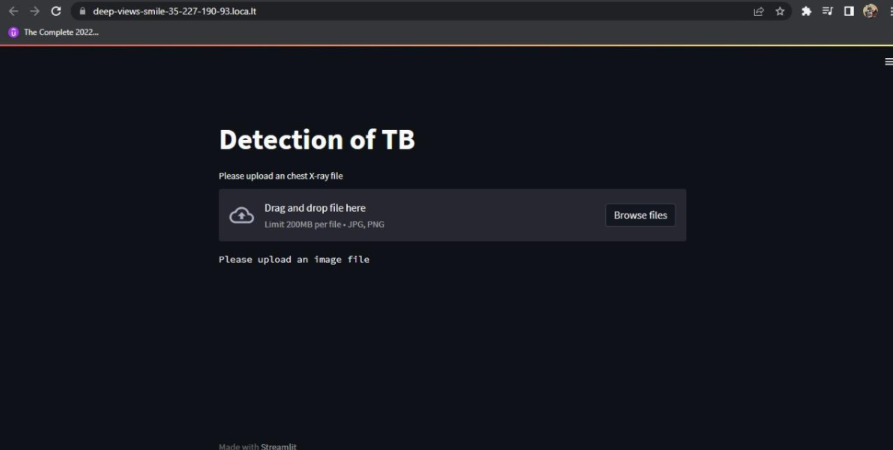
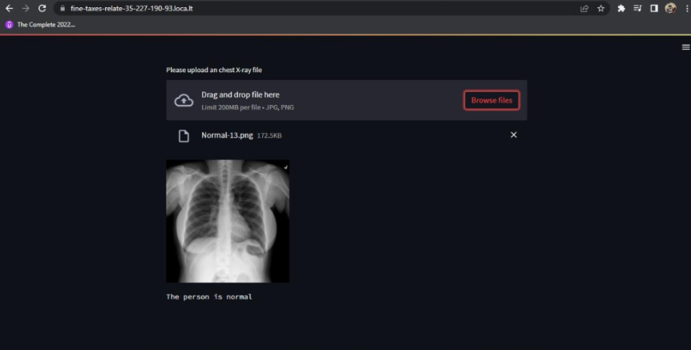
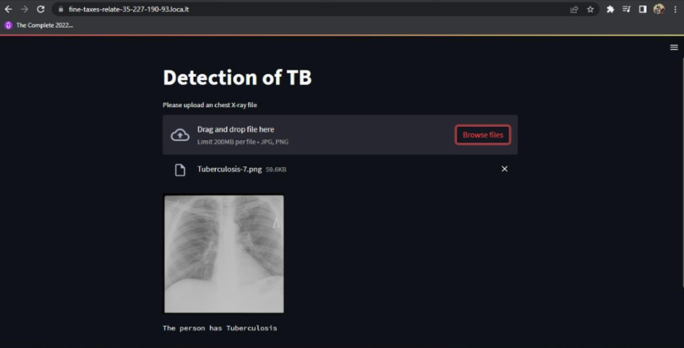
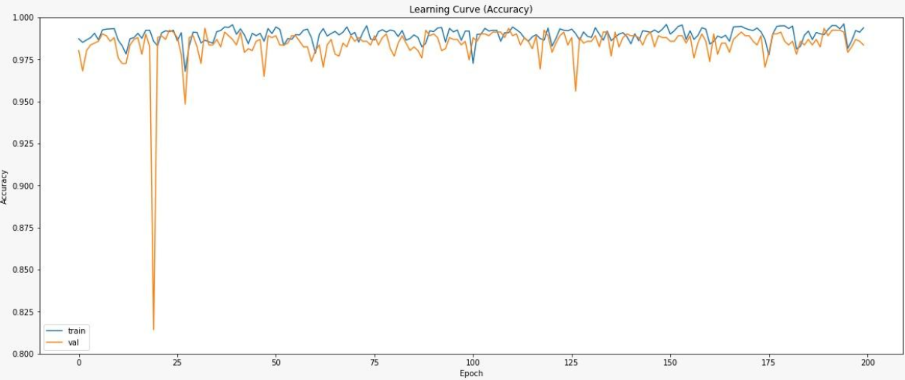
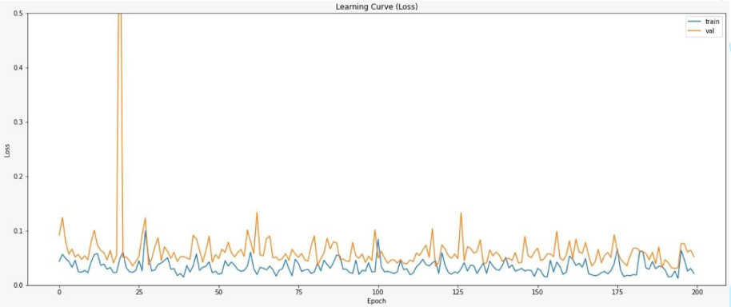
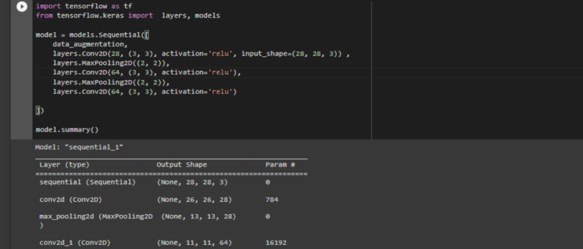
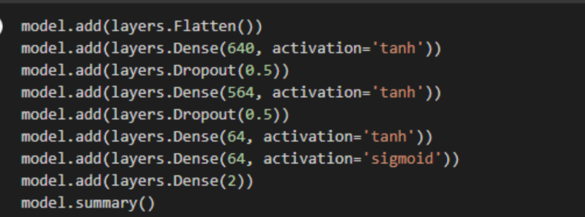
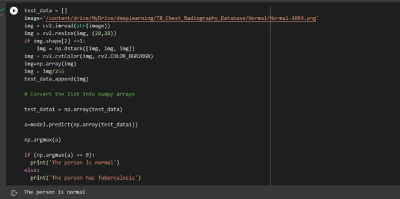

# Tuberculosis Detection using CNN & Streamlit

## Overview
This project implements a Convolutional Neural Network (CNN) to detect tuberculosis from chest X-ray images. The system is deployed using Streamlit to provide an easy-to-use interface for real-time diagnosis.

The solution demonstrates computer vision, deep learning, and deployment of AI models for healthcare applications.

---

## Key Features
- CNN-based chest X-ray classification
- Achieved ~98% accuracy
- Streamlit interface for real-time predictions
- Supports image upload and instant diagnosis
- Designed for healthcare decision support

---

## My Contribution
- Developed and trained the CNN model
- Preprocessed medical image datasets
- Evaluated model performance using accuracy & loss metrics
- Built and tested Streamlit interface for user interaction
- Validated predictions on normal and TB cases

---

## Streamlit Interface

The web interface allows users to upload chest X-ray images and receive instant predictions.

---

## Model Predictions

### Normal Case

### Tuberculosis Case

---

## Model Performance

### Accuracy Curve

### Loss Curve

The model demonstrates high accuracy and stable convergence during training.

---

## Training & Evaluation Logs

---

## Prediction Pipeline Example

---

## Demo Videos

### Code Walkthrough
https://drive.google.com/file/d/1x8hF0PcaKSAoOlECP_GTpXCuo4Eorteg/view?usp=sharing

### Streamlit Demo
https://drive.google.com/file/d/13otCkbqM_E05Oru8zuSTWbCRjzQnjPvR/view?usp=sharing

---

## Technologies Used
- Python
- TensorFlow / Keras
- Streamlit
- OpenCV
- NumPy

---

## Dataset
- Kaggle TB Chest X-ray dataset
- OpenI medical imaging dataset

---

## Applications
- AI-assisted tuberculosis diagnosis
- Medical image classification
- Healthcare decision support systems
